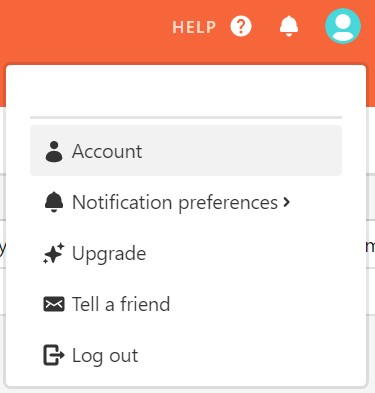
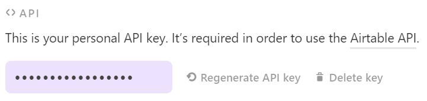
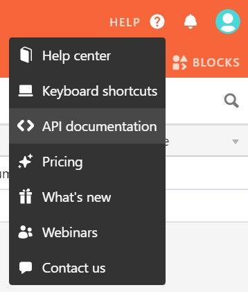
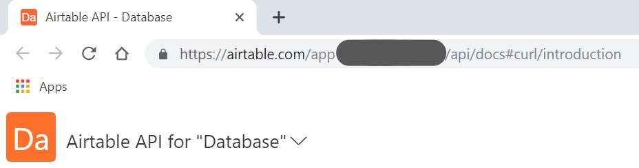

# PHP Airtable Wrapper
PHP Airtable Wrapper for the Airtable API

## Getting Started

Follow these steps to successfully implement this PHP Airtable Wrapper.
*NOTE: The Airtable API allows one to implement basic CRUD functions on records, but does not allow you to make changes to the schema of the tables. Use their interface to make changes to the schema*

### Getting your API Key and Base ID

Two tokens are required to use this wrapper: an api token, and a base id. Follow these steps to get the token:

><kbd></img></kbd>
>
>1. Login to Airtable and click your profile picture.
>2. Click on "Accounts".
>
><kbd></img></kbd>
>
>3. Scroll down to "<> API".
>4. Copy the personal API Key.
>
><kbd></img></kbd>
>
>5. Navigate to the base you want to access with this wrapper.
>6. Click on the Help icon.
>7. Click on "<> API Documentation".
>
><kbd></img></kbd>
>
>8. Look at the URL and find the portion of the url that begins with 'app'.
>9. Copy your base ID.

### Class Installation

You can either use composer or download the classes directly. To download using composer, run the following command:

```
composer require pcbowers/php-airtable
```

If you are using composer, run the autoloader to include the various classes in your project:

```php
require 'vendor/autoload.php';
```

If you downloaded the classes directly, include the airtable.php file:

```php
include('../src/airtable.php');
```

### Initialize the Class

Use the following code snippet with your API Key and Base ID to begin using the wrapper:

```php
use \pcbowers\Airtable\airtable;
$airtable = new Airtable(array(
    'api_key' => 'api_key',
    'base'    => 'base_id'
));
```

## Examples

### getApiKey & getBaseId

### listRecords

### retrieveRecord

### createRecord

### updateRecord

### deleteRecord


### getLastLog & getLog
